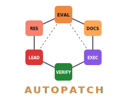
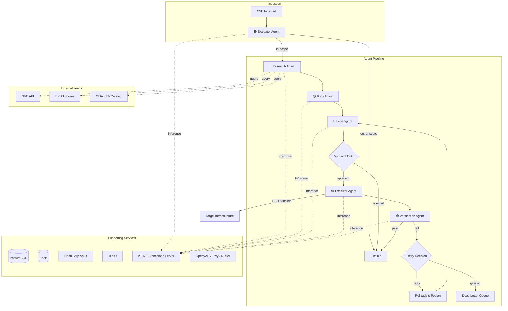
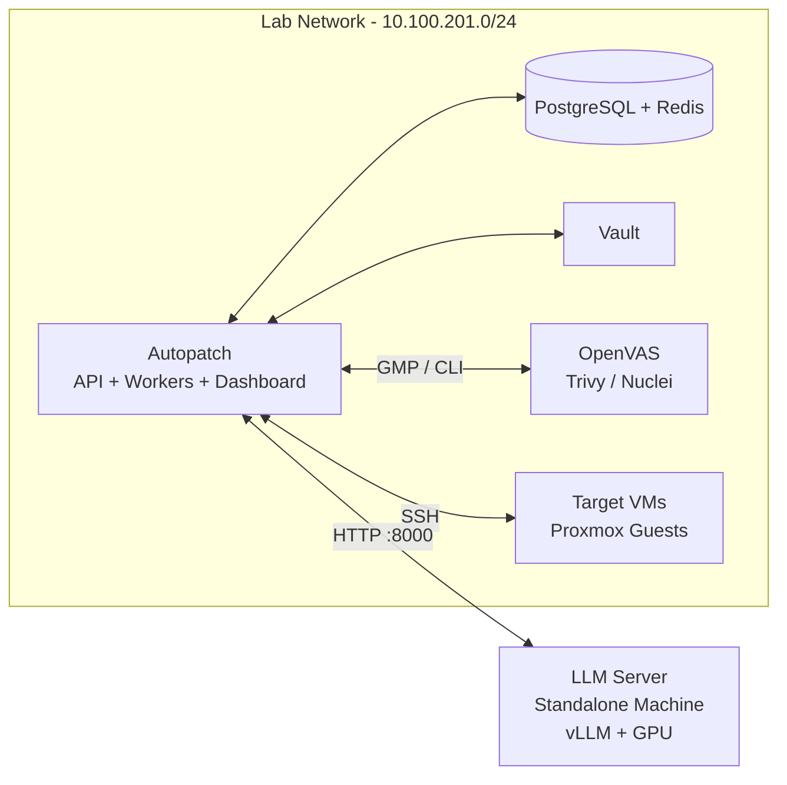
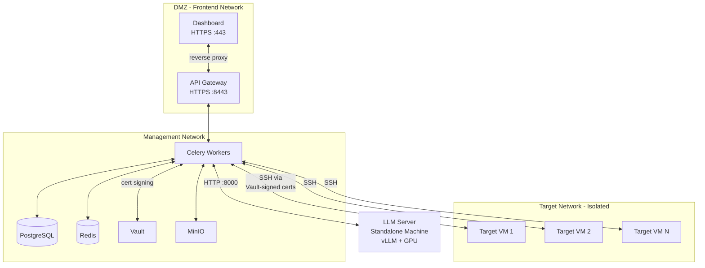

<p align="center">
  
</p>

<h1 align="center">Autopatch</h1>

<p align="center">
  <em>An agentic LLM framework for autonomous vulnerability remediation</em>
</p>

<p align="center">
  
  
  
  
  
</p>

---

## Overview

Autopatch is an AI-powered platform that discovers, evaluates, and automatically remediates security vulnerabilities across infrastructure using a multi-agent LLM pipeline. Rather than generating advisories for humans to act on, Autopatch closes the remediation loop — from CVE ingestion through patch execution and verification — autonomously.

**Research motivation.** The volume of published CVEs continues to grow year over year, far outpacing the capacity of security teams to triage and remediate them manually. Agentic AI offers a path forward: specialized agents can reason about vulnerability context, research fixes across documentation and knowledge bases, formulate remediation plans, execute patches on target infrastructure, and verify the results — all without human intervention for routine fixes.

**What makes Autopatch novel.** The system orchestrates six specialized agents via [LangGraph](https://github.com/langchain-ai/langgraph), each equipped with domain-specific tools (SSH, Ansible, Terraform, OpenVAS, Trivy, Nuclei, InSpec, NVD). A security sandbox layer — command allowlists, risk scoring, and argument validation — constrains autonomous execution to safe operations. Configurable approval gates integrate human oversight where organizational policy requires it, enabling a spectrum from fully autonomous to human-in-the-loop remediation.

## System Architecture



## Network Topology

### Lab / Getting Started

A minimal single-network deployment suitable for development and experimentation. The LLM server runs on a dedicated machine with GPU.



### Production (Recommended)

A segmented deployment with network-level isolation between zones. The LLM server remains a standalone machine connected to the management network.



## Quick Start

### Prerequisites

- [Git](https://git-scm.com/)
- [Docker](https://docs.docker.com/get-docker/) and Docker Compose v2+
- [uv](https://docs.astral.sh/uv/) (Python package manager)
- [nvm](https://github.com/nvm-sh/nvm) and Node.js 22+ (`nvm install 22 && nvm use 22`)
- [Bun](https://bun.sh/) (dashboard package manager)
- A separate machine with a CUDA-capable GPU for the LLM server ([vLLM](https://docs.vllm.ai/))

### 1. Clone and configure

```bash
git clone https://github.com/bkoro/autopatch.git
cd autopatch
cp .env.example .env
```

**Set up the Python environment:**

```bash
uv venv
uv sync
```

**Set up the dashboard:**

```bash
cd dashboard
bun install
cd ..
```

Edit `.env` and set at minimum:

| Variable | Description |
|----------|-------------|
| `JWT_SECRET_KEY` | Random string for JWT signing — **change from default** |
| `LLM_BASE_URL` | URL of your vLLM server (e.g., `http://10.0.0.50:8000/v1`) |
| `POSTGRES_PASSWORD` | Database password |

### 2. Start the stack

```bash
make up          # API, Dashboard, PostgreSQL, Redis
make migrate     # Run database migrations
make seed        # Create default users and sample assets
```

To include the OpenVAS vulnerability scanner:

```bash
make up-full
```

### Troubleshooting

<details>
<summary><strong>Turbopack runtime error on <code>bun run dev</code></strong></summary>

If you see `An unexpected Turbopack error occurred` when starting the dashboard:

1. **Ensure dependencies are installed:** Run `bun install` inside the `dashboard/` directory.
2. **Check Node.js version:** Next.js 16 requires Node.js 22+. Run `node --version` to verify. Use `nvm install 22 && nvm use 22` if needed.
3. **Check the terminal output:** The real error is printed in the terminal where `bun run dev` is running, not in the browser. Look for missing modules or syntax errors.
4. **Clear the cache:** Run `rm -rf dashboard/.next && bun run dev` to rebuild from scratch.

</details>

<details>
<summary><strong>401 Unauthorized on the dashboard</strong></summary>

The API requires authentication. After running `make seed`, log in with:

| Email | Password | Role |
|-------|----------|------|
| `admin@autopatch.local` | `changeme123` | admin |
| `operator@autopatch.local` | `changeme123` | operator |
| `viewer@autopatch.local` | `changeme123` | viewer |

</details>

<details>
<summary><strong><code>relation "users" does not exist</code> on <code>make seed</code></strong></summary>

Run `make migrate` before `make seed`. The migration creates the database tables that the seed script populates.

```bash
make migrate && make seed
```

</details>

### 3. Open the dashboard

Navigate to [http://localhost:3000](http://localhost:3000) in your browser.

### 4. Start the LLM server (on the GPU machine)

```bash
pip install vllm
vllm serve Qwen/Qwen3-30B-A3B --port 8000
```

Ensure `LLM_BASE_URL` in your `.env` points to this machine's address.

## Advanced Setup

<details>
<summary><strong>Environment Variables Reference</strong></summary>

Full list of environment variables, grouped by service.

| Variable | Default | Description |
|----------|---------|-------------|
| **Database** | | |
| `POSTGRES_USER` | `autopatch` | PostgreSQL username |
| `POSTGRES_PASSWORD` | `autopatch_dev` | PostgreSQL password |
| `POSTGRES_DB` | `autopatch` | Database name |
| `DATABASE_URL` | `postgresql+asyncpg://...` | Async connection string |
| **Cache & Queue** | | |
| `REDIS_URL` | `redis://localhost:6379/0` | Redis connection |
| `CELERY_BROKER_URL` | `redis://redis:6379/1` | Celery broker |
| `CELERY_RESULT_BACKEND` | `redis://redis:6379/2` | Celery result store |
| **Authentication** | | |
| `JWT_SECRET_KEY` | *(must change)* | JWT signing secret |
| `JWT_ALGORITHM` | `HS256` | JWT algorithm |
| `JWT_EXPIRE_MINUTES` | `60` | Token expiry |
| `API_KEYS` | `dev-api-key-1,...` | Comma-separated API keys |
| **LLM** | | |
| `LLM_BASE_URL` | `http://vllm:8001/v1` | OpenAI-compatible endpoint |
| `LLM_MODEL` | `Qwen/Qwen3-30B-A3B` | Model identifier |
| **Vault** | | |
| `VAULT_ADDR` | `http://vault:8200` | Vault server address |
| `VAULT_ROLE_ID` | *(empty)* | AppRole role ID |
| `VAULT_SECRET_ID` | *(empty)* | AppRole secret ID |
| **Scanners** | | |
| `GMP_HOST` | `gvmd` | Greenbone GMP host |
| `GMP_PORT` | `9390` | Greenbone GMP port |
| `GMP_USERNAME` | `admin` | Greenbone username |
| `GMP_PASSWORD` | `admin` | Greenbone password |
| `NVD_API_KEY` | *(empty, optional)* | NVD API key for higher rate limits |
| **MinIO** | | |
| `MINIO_ENDPOINT` | `minio:9000` | MinIO endpoint |
| `MINIO_ACCESS_KEY` | `autopatch` | MinIO access key |
| `MINIO_SECRET_KEY` | `autopatch_dev` | MinIO secret key |
| `MINIO_BUCKET` | `autopatch` | Default bucket |
| **Proxmox** | | |
| `PROXMOX_API_URL` | `https://...:8006` | Proxmox API endpoint |
| `PROXMOX_API_TOKEN` | *(must set)* | API token |
| `PROXMOX_NODE` | `pve` | Proxmox node name |
| **Execution** | | |
| `EXECUTOR_SSH_USER` | `autopatch` | SSH user on target hosts |
| `EXECUTOR_CERT_TTL` | `5m` | Vault-signed certificate TTL |
| **Notifications** | | |
| `NOTIFICATION_WEBHOOK_URL` | *(empty)* | Webhook for alerts |
| **App** | | |
| `APP_NAME` | `Autopatch` | Application name |
| `DEBUG` | `true` | Debug mode |
| `LOG_LEVEL` | `INFO` | Log level |

</details>

<details>
<summary><strong>LLM Server Setup</strong></summary>

Autopatch communicates with any OpenAI-compatible inference endpoint. The recommended setup is [vLLM](https://docs.vllm.ai/) running on a standalone machine with a CUDA-capable GPU.

**Install and serve on the GPU machine:**

```bash
pip install vllm
vllm serve Qwen/Qwen3-30B-A3B --port 8000
```

Set `LLM_BASE_URL=http://<gpu-machine-ip>:8000/v1` and `LLM_MODEL=Qwen/Qwen3-30B-A3B` in your `.env`.

**Local testing (CPU, slow):**

```bash
make vllm
```

This starts a local vLLM container using the model specified in your `.env`. Useful for integration testing without a GPU machine.

**Any OpenAI-compatible endpoint works.** You can point `LLM_BASE_URL` at OpenAI, Azure OpenAI, Ollama, or any compatible server by updating `LLM_BASE_URL` and `LLM_MODEL`.

</details>

<details>
<summary><strong>Vault &amp; SSH Certificates</strong></summary>

Autopatch uses [HashiCorp Vault](https://www.vaultproject.io/) to issue short-lived SSH certificates for the Executor Agent. This avoids distributing static SSH keys and provides a full audit trail of remote commands.

**Initialize Vault:**

```bash
make vault        # Start the Vault container
make vault-init   # Bootstrap AppRole auth and SSH secrets engine
```

The init script writes `VAULT_ROLE_ID` and `VAULT_SECRET_ID` to `.env` automatically. Review `deploy/docker/vault/vault-config.hcl` for the Vault configuration.

**Target host requirements:**

Each target host must trust Vault's CA public key. Add the following to `/etc/ssh/sshd_config` on each target:

```
TrustedUserCAKeys /etc/ssh/trusted-ca.pub
```

Fetch the CA public key with:

```bash
vault read -field=public_key ssh/config/ca > trusted-ca.pub
```

**Certificate TTL:**

Certificates are issued with a 5-minute TTL (`EXECUTOR_CERT_TTL=5m`). Each remediation task requests a fresh certificate scoped to the target host, minimizing the blast radius of any credential compromise.

</details>

<details>
<summary><strong>Scanner Integration</strong></summary>

Autopatch integrates three scanning tools for vulnerability discovery and post-patch verification.

| Scanner | Purpose | Interface |
|---------|---------|-----------|
| [OpenVAS / Greenbone](https://www.greenbone.net/) | Network vulnerability scanning | GMP protocol over TCP |
| [Trivy](https://trivy.dev/) | Container and filesystem scanning | CLI |
| [Nuclei](https://nuclei.projectdiscovery.io/) | Template-based web/service scanning | CLI |

**Start the full stack including OpenVAS:**

```bash
make up-full
```

OpenVAS requires significant resources (2+ GB RAM) and several minutes to initialize its feed on first run. The API will wait for the GMP socket to become available before attempting connections.

Configure scanner credentials via the `GMP_*` environment variables (see Environment Variables Reference).

</details>

<details>
<summary><strong>Terraform / Proxmox Provisioning</strong></summary>

The `terraform/` directory contains modules for provisioning and managing target infrastructure on Proxmox.

| Module | Purpose |
|--------|---------|
| `terraform/modules/network/` | VLAN and network segment provisioning |
| `terraform/modules/snapshot/` | VM snapshot lifecycle management |

**Clone a target VM for testing:**

```bash
cd terraform/environments/dev
terraform init
terraform apply -var-file=terraform.tfvars
```

Set `PROXMOX_API_URL`, `PROXMOX_API_TOKEN`, and `PROXMOX_NODE` in your `.env` before running Terraform. The Proxmox provider reads these from environment variables automatically.

The `clone-vm` workflow clones a template VM, registers it as an asset in the Autopatch database, and makes it available as a remediation target.

</details>

<details id="development-workflow">
<summary><strong>Development Workflow</strong></summary>

**Start individual services:**

```bash
make api           # FastAPI development server (hot reload)
make dashboard     # Next.js dev server (uses bun)
make worker        # Celery worker (all queues)
make worker-agents # Celery worker (agent queue only)
make beat          # Celery beat scheduler
```

**Database:**

```bash
make migrate       # Apply pending Alembic migrations
```

**Testing and linting:**

```bash
make test          # Run full test suite (pytest)
make lint          # Ruff + mypy
make format        # Ruff format + isort
```

**Data enrichment:**

```bash
make enrich-epss   # Pull latest EPSS scores from FIRST.org
make enrich-kev    # Sync CISA KEV catalog
make enrich-nvd    # Fetch recent NVD CVE data
```

The dashboard uses [bun](https://bun.sh/) as its package manager. Run `bun install` inside `dashboard/` before `make dashboard` on a fresh checkout.

</details>

<details>
<summary><strong>Data Enrichment</strong></summary>

Autopatch enriches CVE records with threat intelligence from three external sources.

| Source | Command | Description |
|--------|---------|-------------|
| [EPSS](https://www.first.org/epss/) | `make enrich-epss` | Exploit Prediction Scoring System — daily probability scores for each CVE |
| [CISA KEV](https://www.cisa.gov/known-exploited-vulnerabilities-catalog) | `make enrich-kev` | Known Exploited Vulnerabilities catalog — CVEs with confirmed active exploitation |
| [NVD](https://nvd.nist.gov/) | `make enrich-nvd` | National Vulnerability Database — CVSS scores, CWE classifications, CPE data |

Enrichment jobs run automatically on a schedule via Celery Beat. Run the commands above to trigger an immediate sync.

Set `NVD_API_KEY` in your `.env` for higher NVD rate limits (50 req/30s vs 5 req/30s without a key). Register for a free key at [nvd.nist.gov/developers/request-an-api-key](https://nvd.nist.gov/developers/request-an-api-key).

</details>

## Scope of Vulnerabilities

Autopatch is scoped to treat vulnerabilities related to **system administration, infrastructure, and state configuration** on Linux systems. It explicitly distinguishes itself from software engineering tasks such as modifying application source code to fix bugs like SQL injection or XSS.

### In-Scope Categories

| Category | Description | Examples |
|----------|-------------|----------|
| **Configuration Vulnerabilities** | Security issues remediated by modifying system or application configuration files to enforce secure states | Insecure `sshd_config` (root login permitted), misconfigured `nginx.conf` (directory traversal), weak `pg_hba.conf` (trust authentication), cron jobs executing world-writable scripts as root, insecure NFS exports (`no_root_squash`), databases bound to public interfaces without authentication |
| **Dependency & Package Management** | Vulnerabilities from outdated, unpatched, or compromised software packages | Log4j (CVE-2021-44228), Dirty COW (CVE-2016-5195), outdated Samba/OpenSSH/ProFTPD versions |
| **Permissions & Access Control** | Improper file ownership, unauthorized user access, or hazardous network exposure | SUID/SGID bit misconfigurations, world-writable `/etc/passwd`, overly permissive sudoers, misconfigured firewall rules |

### Scope Constraints

- **CWE filtering:** The Evaluator Agent filters for Infrastructure and Configuration CWEs during triage, routing only in-scope vulnerabilities into the remediation pipeline.
- **Operating system:** The domain targets Linux systems, bounded to objects such as hosts, files, directories, users, groups, services, packages, ports, and firewall rules.
- **Out of scope:** Application-layer bugs requiring source code changes (e.g., SQL injection, insecure deserialization, XSS) fall outside the framework's remediation capabilities.

## Agent Pipeline

Autopatch orchestrates six specialized agents via [LangGraph](https://github.com/langchain-ai/langgraph). Each agent is a node in a directed graph with conditional edges that route based on prior agent outputs.

| Agent | Role | Tools |
|-------|------|-------|
| **Evaluator** | Determines whether a CVE is in-scope for automated remediation | NVD data, EPSS scores |
| **Research** | Gathers vulnerability context and remediation options | NVD tool, CVE feeds |
| **Docs** | Searches knowledge bases for official fixes and vendor advisories | Documentation search |
| **Lead** | Synthesizes a remediation strategy and execution plan | Context from all prior agents |
| **Executor** | Executes remediation commands on target infrastructure | SSH, Ansible, Terraform, command sandbox |
| **Verification** | Validates that the fix was applied successfully | InSpec, post-execution checks |

Additional control nodes: **Approval Gate** (human-in-the-loop when policy requires), **Retry Decision**, **Rollback & Replan**, and **Dead Letter Queue** for irrecoverable failures.

The executor operates within a security sandbox that enforces command allowlists, scores risk for each proposed action, and validates arguments before execution.

## Tech Stack

| Layer | Technologies |
|-------|-------------|
| **Backend** | Python 3.13+, FastAPI, Celery, SQLAlchemy, asyncpg |
| **LLM Orchestration** | LangGraph, vLLM (Qwen3-30B-A3B), OpenAI-compatible API |
| **Frontend** | Next.js, React 19, TypeScript, Tailwind CSS, TanStack Query, Recharts |
| **Database** | PostgreSQL, Alembic migrations |
| **Cache & Queue** | Redis (Celery broker + result backend) |
| **Security** | HashiCorp Vault (SSH certificate signing), JWT, command sandboxing |
| **Scanning** | OpenVAS / Greenbone, Trivy, Nuclei, InSpec |
| **Infrastructure** | Terraform, Proxmox, Ansible, Docker Compose |
| **Storage** | MinIO (S3-compatible object storage) |
| **CVE Intelligence** | NVD API, EPSS, CISA KEV catalog |

## Contributing

Contributions are welcome. To get started:

1. Fork the repository
2. Create a feature branch (`git checkout -b feat/your-feature`)
3. Set up the development environment (see [Development Workflow](#development-workflow) above)
4. Run tests before submitting: `make test`
5. Open a pull request

## License

*License TBD — please check back or open an issue.*

## Citation

If you use Autopatch in academic work, please cite:

```bibtex
@software{autopatch2026,
  title   = {Autopatch: An Agentic LLM Framework for Autonomous Vulnerability Remediation},
  author  = {Orojo, Abanisenioluwa Kolawole},
  year    = {2026},
  url     = {https://github.com/bkoro/autopatch}
}
```
